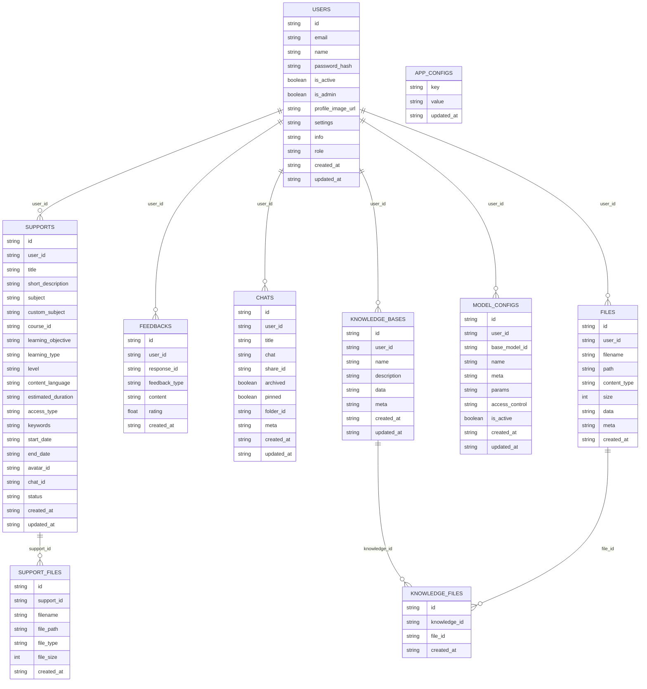

# Database Schema

This project uses SQLAlchemy models from `data/models` and initializes tables with
`Base.metadata.create_all()` in `data/database.py`.

Default database URL:

```env
DATABASE_URL=sqlite:///./var/tutorai.db
```

## Entity Relationship Diagram



Legend:

- `PK`: primary key.
- `FK`: database-enforced foreign key.
- `UK`: unique key.
- Indexed columns are documented in the table notes below.
- Solid relationships are declared with SQLAlchemy `ForeignKey`.
- Dotted relationships are logical/application-level associations only.

## Tables

### `users`

Defined by `data/models/user.py`.

| Column              | Type          | Notes                     |
| ------------------- | ------------- | ------------------------- |
| `id`                | `String(36)`  | Primary key               |
| `email`             | `String(255)` | Required, unique, indexed |
| `name`              | `String(255)` | Required                  |
| `password_hash`     | `String(255)` | Required                  |
| `is_active`         | `Boolean`     | Defaults to `true`        |
| `is_admin`          | `Boolean`     | Defaults to `false`       |
| `profile_image_url` | `String(255)` | Optional                  |
| `settings`          | `JSON`        | Optional                  |
| `info`              | `JSON`        | Optional                  |
| `role`              | `String(50)`  | Defaults to `user`        |
| `created_at`        | `DateTime`    | Required                  |
| `updated_at`        | `DateTime`    | Required, auto-updated    |

### `chats`

Defined by `data/models/chat.py`.

| Column       | Type         | Notes                                         |
| ------------ | ------------ | --------------------------------------------- |
| `id`         | `String(36)` | Primary key, UUID default                     |
| `user_id`    | `String(36)` | Required, indexed, logical link to `users.id` |
| `title`      | `Text`       | Required, defaults to `New Chat`              |
| `chat`       | `JSON`       | Optional chat payload                         |
| `share_id`   | `String(36)` | Optional, unique, indexed                     |
| `archived`   | `Boolean`    | Required, defaults to `false`                 |
| `pinned`     | `Boolean`    | Required, defaults to `false`                 |
| `folder_id`  | `String(36)` | Optional, indexed                             |
| `meta`       | `JSON`       | Optional                                      |
| `created_at` | `DateTime`   | Required                                      |
| `updated_at` | `DateTime`   | Required, auto-updated                        |

### `supports`

Defined by `data/models/support.py`.

| Column               | Type          | Notes                               |
| -------------------- | ------------- | ----------------------------------- |
| `id`                 | `String(36)`  | Primary key                         |
| `user_id`            | `String(36)`  | Required, foreign key to `users.id` |
| `title`              | `String(255)` | Required                            |
| `short_description`  | `Text`        | Optional                            |
| `subject`            | `String(255)` | Optional                            |
| `custom_subject`     | `String(255)` | Optional                            |
| `course_id`          | `String(36)`  | Optional                            |
| `learning_objective` | `Text`        | Optional                            |
| `learning_type`      | `String(100)` | Optional                            |
| `level`              | `String(100)` | Optional                            |
| `content_language`   | `String(100)` | Defaults to `English`               |
| `estimated_duration` | `String(100)` | Optional                            |
| `access_type`        | `String(50)`  | Defaults to `Private`               |
| `keywords`           | `Text`        | Optional comma-separated values     |
| `start_date`         | `String(50)`  | Optional                            |
| `end_date`           | `String(50)`  | Optional                            |
| `avatar_id`          | `String(36)`  | Optional                            |
| `chat_id`            | `String(36)`  | Optional logical link to `chats.id` |
| `status`             | `String(50)`  | Defaults to `pending`               |
| `created_at`         | `DateTime`    | Required                            |
| `updated_at`         | `DateTime`    | Required, auto-updated              |

### `support_files`

Defined by `data/models/support.py`.

| Column       | Type          | Notes                                                  |
| ------------ | ------------- | ------------------------------------------------------ |
| `id`         | `String(36)`  | Primary key                                            |
| `support_id` | `String(36)`  | Required, foreign key to `supports.id`, cascade delete |
| `filename`   | `String(255)` | Required                                               |
| `file_path`  | `String(500)` | Required                                               |
| `file_type`  | `String(100)` | Optional                                               |
| `file_size`  | `Integer`     | Optional                                               |
| `created_at` | `DateTime`    | Required                                               |

### `feedbacks`

Defined by `data/models/feedback.py`.

| Column          | Type          | Notes                               |
| --------------- | ------------- | ----------------------------------- |
| `id`            | `String(36)`  | Primary key                         |
| `user_id`       | `String(36)`  | Required, foreign key to `users.id` |
| `response_id`   | `String(255)` | Optional, indexed                   |
| `feedback_type` | `String(50)`  | Required                            |
| `content`       | `Text`        | Optional                            |
| `rating`        | `Float`       | Optional                            |
| `created_at`    | `DateTime`    | Required                            |

### `files`

Defined by `data/models/file.py`.

| Column         | Type          | Notes                                         |
| -------------- | ------------- | --------------------------------------------- |
| `id`           | `String(36)`  | Primary key                                   |
| `user_id`      | `String(36)`  | Required, indexed, logical link to `users.id` |
| `filename`     | `Text`        | Required                                      |
| `path`         | `Text`        | Optional disk path                            |
| `content_type` | `String(255)` | Optional                                      |
| `size`         | `Integer`     | Optional                                      |
| `data`         | `JSON`        | Optional extracted or structured content      |
| `meta`         | `JSON`        | Optional metadata                             |
| `created_at`   | `DateTime`    | Required                                      |

### `model_configs`

Defined by `data/models/model.py`.

| Column           | Type          | Notes                                         |
| ---------------- | ------------- | --------------------------------------------- |
| `id`             | `String(255)` | Primary key                                   |
| `user_id`        | `String(36)`  | Required, indexed, logical link to `users.id` |
| `base_model_id`  | `String(255)` | Optional                                      |
| `name`           | `String(255)` | Required                                      |
| `meta`           | `JSON`        | Optional                                      |
| `params`         | `JSON`        | Optional                                      |
| `access_control` | `JSON`        | Optional                                      |
| `is_active`      | `Boolean`     | Required, defaults to `true`                  |
| `created_at`     | `DateTime`    | Required                                      |
| `updated_at`     | `DateTime`    | Required, auto-updated                        |

### `app_configs`

Defined by `data/models/config.py`.

| Column       | Type          | Notes                  |
| ------------ | ------------- | ---------------------- |
| `key`        | `String(255)` | Primary key            |
| `value`      | `JSON`        | Optional               |
| `updated_at` | `DateTime`    | Required, auto-updated |

### `knowledge_bases`

Defined by `data/models/knowledge.py`.

| Column        | Type          | Notes                                         |
| ------------- | ------------- | --------------------------------------------- |
| `id`          | `String(36)`  | Primary key, UUID default                     |
| `user_id`     | `String(36)`  | Required, indexed, logical link to `users.id` |
| `name`        | `String(255)` | Required                                      |
| `description` | `Text`        | Optional                                      |
| `data`        | `JSON`        | Optional                                      |
| `meta`        | `JSON`        | Optional, used for access control/tags        |
| `created_at`  | `DateTime`    | Required                                      |
| `updated_at`  | `DateTime`    | Required, auto-updated                        |

### `knowledge_files`

Defined by `data/models/knowledge.py`.

| Column         | Type         | Notes                                                  |
| -------------- | ------------ | ------------------------------------------------------ |
| `id`           | `String(36)` | Primary key, UUID default                              |
| `knowledge_id` | `String(36)` | Required, indexed, foreign key to `knowledge_bases.id` |
| `file_id`      | `String(36)` | Required, logical link to `files.id`                   |
| `created_at`   | `DateTime`   | Required                                               |

## Association Summary

| Source                         | Target               | Type                                    | Enforced by DB? |
| ------------------------------ | -------------------- | --------------------------------------- | --------------- |
| `supports.user_id`             | `users.id`           | Many supports to one user               | Yes             |
| `feedbacks.user_id`            | `users.id`           | Many feedbacks to one user              | Yes             |
| `support_files.support_id`     | `supports.id`        | Many files to one support request       | Yes             |
| `knowledge_files.knowledge_id` | `knowledge_bases.id` | Many linked files to one knowledge base | Yes             |
| `chats.user_id`                | `users.id`           | Many chats to one user                  | No              |
| `files.user_id`                | `users.id`           | Many uploaded files to one user         | No              |
| `model_configs.user_id`        | `users.id`           | Many model configs to one user          | No              |
| `knowledge_bases.user_id`      | `users.id`           | Many knowledge bases to one user        | No              |
| `knowledge_files.file_id`      | `files.id`           | Many knowledge links to one file        | No              |
| `supports.chat_id`             | `chats.id`           | Optional support-to-chat link           | No              |
